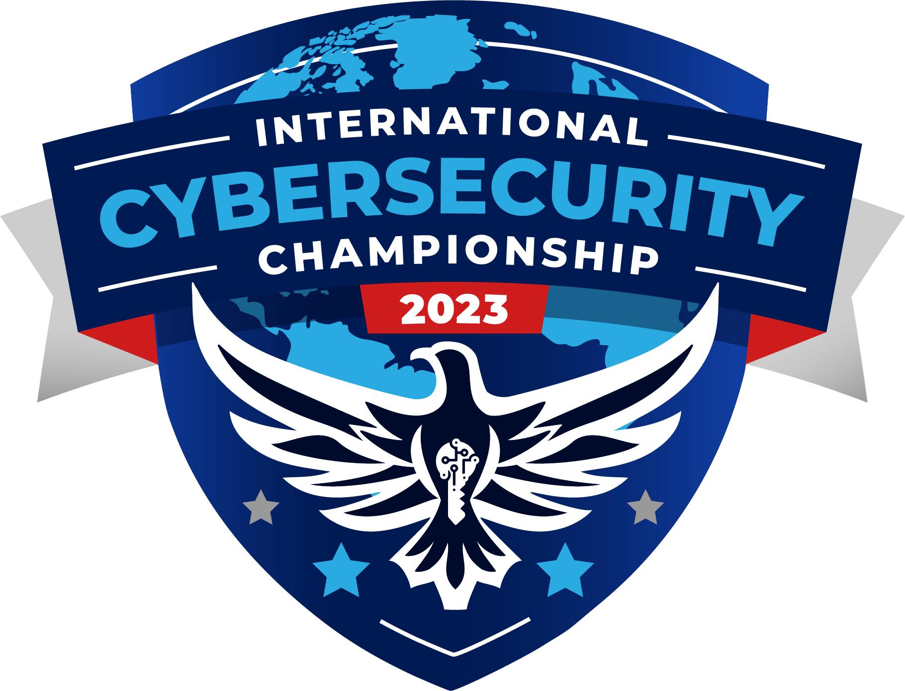
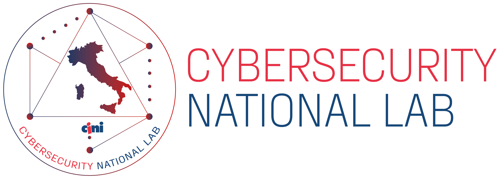

# ICC2023 - A/D Services

Attack/Defense services for the 2nd International Cybersecurity Challenge @ San Diego, California USA organized by the team of the [CINI - Cybersecurity National Laboratory](https://cybersecnatlab.it)

  
  

Event coordinators: [Matteo Rossi](https://github.com/mr-96) & [Gaspare Ferraro](https://github.com/GaspareG)

Platform and system administrators: [Giovanni Minotti](https://github.com/Giotino) and [Gianluca Altomani](https://github.com/devgianlu)

## Services

|  #  | service                                 | store | vulns | port(s)  | categories       | author(s)                                                                            |
| :-: | :-------------------------------------- | :---: | :---: | :------- | ---------------- | ------------------------------------------------------------------------------------ |
|  1  | [SeaOfHackerz](/sources/SeaOfHackerz)   |   1   |   3   | 80, 5000 | crypto, web      | Vittorio Mignini <@M1gnus>, Matteo Protopapa <@matpro>                               |
|  2  | [ArcaneLink](/sources/ArcaneLink)       |   1   |   2   | 1337     | pwn, system      | Marco Bonelli <@mebeim>, Vincenzo Bonforte <@bonfee>                                 |
|  3  | [MaScroll](/sources/MaScroll)           |   2   |   3   | 80       | pwn, web, crypto | Andrea Biondo <@abiondo>, Riccardo Bonafede <@bonaff>, Francesco Felet <@PhiQuadro>  |
|  4  | [NorthernFiles](/sources/NorthernFiles) |   1   |   2   | 80       | crypto, web      | Lorenzo Leonardini <@pianka>, Matteo Rossi <@mr96>                                   |
|  5  | [UberPendragon](/sources/UberPendragon) |   1   |   1   | 80, 5000 | crypto           | Francesco Felet <@PhiQuadro>, Vittorio Mignini <@M1gnus>, Matteo Protopapa <@matpro> |

## Checkers & exploits

See [checkers/](/checkers) and [exploits/](/exploits)

## King-of-the-Hill

For the complete source code and data for the ICC2023 King-of-the-Hill (KOTH) game proposed, please have a look to the [ICC2023-KOTH](https://github.com/CybersecNatLab/ICC2023-KOTH) git repository.

## Final scoreboard

## Competition data

- Checks: [checks.csv](/data/checks.csv)
- Flags generated: [flag.csv](/data/flags.csv)
- Services info: [services.csv](/data/services.csv)
- Scoreboard checks: [scoreboard_checks.csv](/data/scoreboard_checks.csv)
- Scoreboard services: [scoreboard_services.csv](/data/scoreboard_services.csv)
- Scoreboard teams: [scoreboard_teams.csv](/data/scoreboard_teams.csv)
- Stolen flags: [stolen_flags.csv](/data/stolen_flags.csv)
- Teams services: [team_services.csv](/data/team_services.csv)
- Teams info: [teams.csv](/data/teams.csv)

## Network diagram

